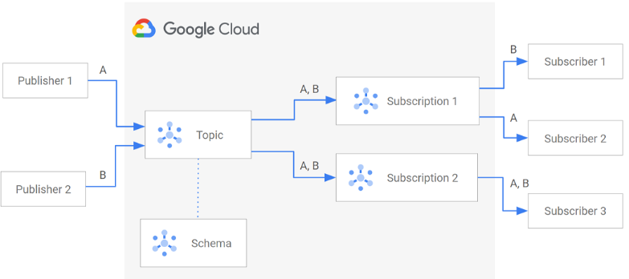
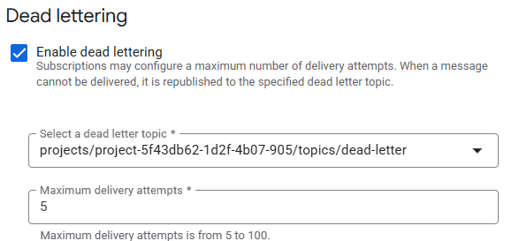
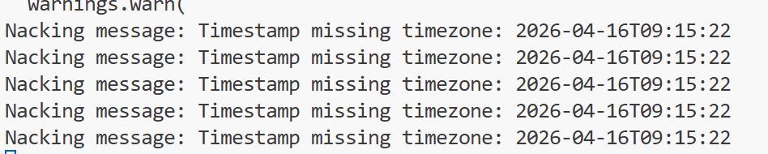
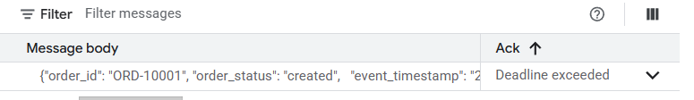
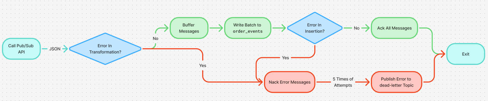
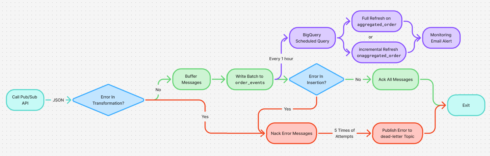
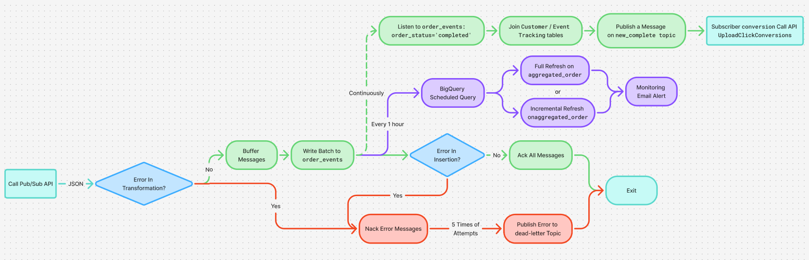

# DE-Assignment

Detailed process of how I completed this assignment.

## 1. Stream Data

### (1) Create Dummy Data in GCP

First take a look at Pub/Sub subscription: haven't heard but should be some specific API, find the official document https://docs.cloud.google.com/pubsub/docs/overview and understand its publish/subscription workflow:
    

- Reopen the GCP project which I have owner role with and enabled Cloud Pub/Sub API
- Create a topic named 'DE-Assignment' with a default pull subscription 'DE-Assignment-sub'
- Create some simple dummy message data in JSON format and publish them in this topic. 
    - As I already read through the next question, I want to create a `order_events` table in which we would have 1 single `order_ID` with 4 different `order_status` at different timestamp. 
    - I also want to involve timezone/currency discrepancy for the next-step transformation as we are dealing with the whole EMEA business data. I assume all the order timestamp data from subscription supposed to have timezone info, and add a check to throw an error if the source timestamp miss it.
- I publish the following message one by one in GCP console:
    ```
    {"order_id": "ORD-10001", "order_status": "created",   "event_timestamp": "2026-04-16T09:15:22", "customer_id": "CUST-1122", "country": "NL", "amount": 48.00,   "currency": "EUR"}
    {"order_id": "ORD-10001", "order_status": "paid",      "event_timestamp": "2026-04-16T09:15:47+02:00", "customer_id": "CUST-1122", "country": "NL", "amount": 48.00,   "currency": "EUR"}
    {"order_id": "ORD-10001", "order_status": "shipped",   "event_timestamp": "2026-04-17T14:32:10+02:00", "customer_id": "CUST-1122", "country": "NL", "amount": 48.00,   "currency": "EUR"}
    {"order_id": "ORD-10001", "order_status": "delivered", "event_timestamp": "2026-04-18T11:08:55+02:00", "customer_id": "CUST-1122", "country": "NL", "amount": 48.00,   "currency": "EUR"}
    {"order_id": "ORD-10002", "order_status": "created",   "event_timestamp": "2026-04-16T11:15:22+03:00", "customer_id": "CUST-1322", "country": "TR", "amount": 2400.00, "currency": "TRY"}
    {"order_id": "ORD-10002", "order_status": "paid",      "event_timestamp": "2026-04-16T11:15:47+03:00", "customer_id": "CUST-1322", "country": "TR", "amount": 2400.00, "currency": "TRY"}
    {"order_id": "ORD-10002", "order_status": "shipped",   "event_timestamp": "2026-04-16T16:32:10+03:00", "customer_id": "CUST-1322", "country": "TR", "amount": 2400.00, "currency": "TRY"}
    {"order_id": "ORD-10002", "order_status": "delivered", "event_timestamp": "2026-04-17T13:08:55+03:00", "customer_id": "CUST-1322", "country": "TR", "amount": 2400.00, "currency": "TRY"}
    ```

### (2) Create datasets and table in BigQuery

- Create dataset named 'de_assignment' in BigQuery console.

- Please check the DDL statement for creating table in `./ingestion.sql` .


### (3) Create a Python script to call API

- Please check the script in `./GCP_Subscription.py` .

- The official python package for calling Google Cloud Pub/Sub API is here: https://docs.cloud.google.com/python/docs/reference/pubsub/latest.

So the main workflow is simple:
- Set up user-defined function `transform` to transform the source data before it is written to BigQuery.
- Call Cloud Pub/Sub API *(for this small demo I shut down the listening session if it hears nothing after 60 secs)*
- Transform source json, append post transformed json(dict) to a list, hold back the messages
- Insert into BigQuery
- Ack the messages together in the end of this batch

However, if the transformation/insertion gives an error (in my case the first record is missing timezone in its timestamp), I first simply thought I could just add one exception in callback:
    ```
    except Exception as e:
            print(f"Error occurred while transforming message: {e}")
            message.nack()
    ```
and yet it goes into a dead loop as it nack->ack->nack->ack...forever. I panic a little bit and kill the terminal.

Then I find they have a subscription property called 'dead-letter topic' to 'manage undeliverable messages that subscribers can't acknowledge, Pub/Sub can forward them to a dead-letter topic'. So I follow the guidance and create a dead-letter topic to store the bad messages.



With this set up, the script will only nack maximum 5 times and then forward the message to dead-letter topic's subscription:





### In the end, the ideal setup should be like this diagram:



## 2. Aggregated Tables

For refreshing table `aggregated_order`, 2 solutions to keep this table updated:

### (1) Full refresh per hour
please check the SQL statement in `./aggregated_order_full_refresh.sql` .

### (2) Incremental refresh per hour
please check the SQL statement in `./aggregated_order_incremental_refresh.sql` .

It involves a scheduler for running queries periodically. I search on how to schedule recurring queries in BigQuery, the most straightforward way seems to be scheduling queries: https://docs.cloud.google.com/bigquery/docs/scheduling-queries, which enable us to do so just by clicking the 'Schedule' button and set up for 1 hour in console. Ideally there should be some setup conceptually equivalent to dbt model, so that the internalized lineage would automatically refresh all the downstream tables if we run `dbt run --select order_events+` .

### The diagram gets updated too:



## 3. Conversion Upload

We can use the `UploadClickConversions` API to manage click conversions in Google Ads.

Source: https://developers.google.com/google-ads/api/reference/rpc/v23/UploadClickConversionsRequest

### (1) As the purpose of this step is campaign attribution, there are several other tables I can think of that we may need to join from:

- **Event tracking tables**: which document the endpoint/entrance that this customer first click on and entrance the campaign landing page.
- **Customer dimension table**: which stores abundant information about this customer and will assist on target group analysis.

### (2) The required fields to the Google Ads API for a successful conversion upload include:

    - conversions related fields: 
        - conversion_date_time: data time that conversion occurred, must be after the click time
        - conversion_action: sole identifier of the conversion action
        - conversion_value
        - currency_code
        - gclid
        - order_id
    - customer_id
    - partial_failure: required to be `true` to always carry out successful operation and return error for invalid ones.
    - validate_only

### The final diagram including conversion upload:


